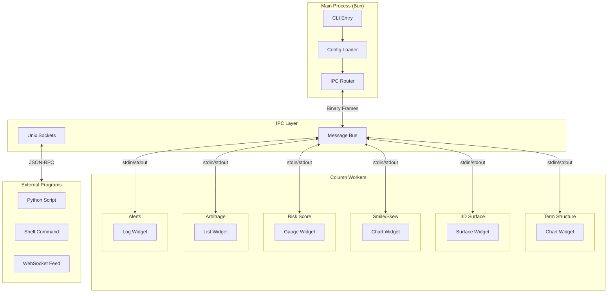
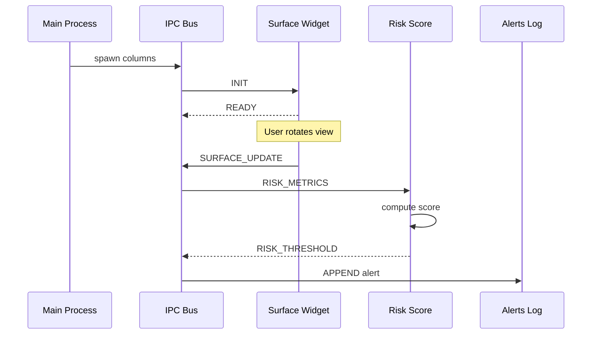
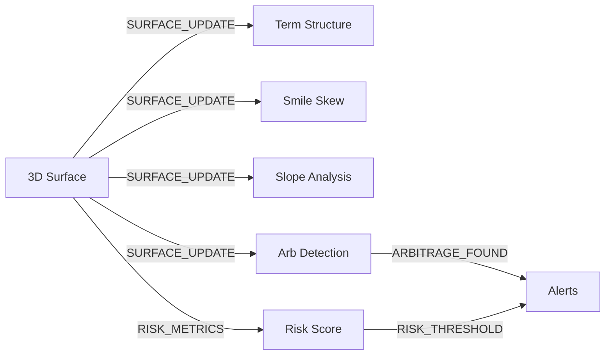
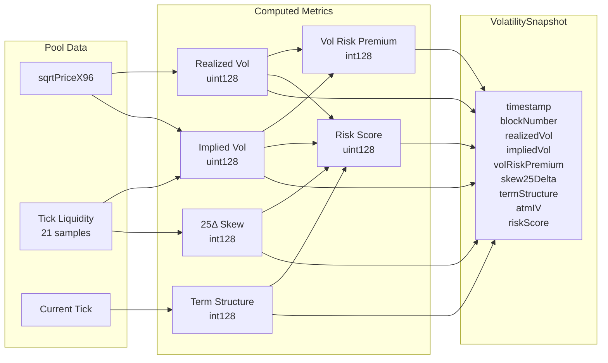
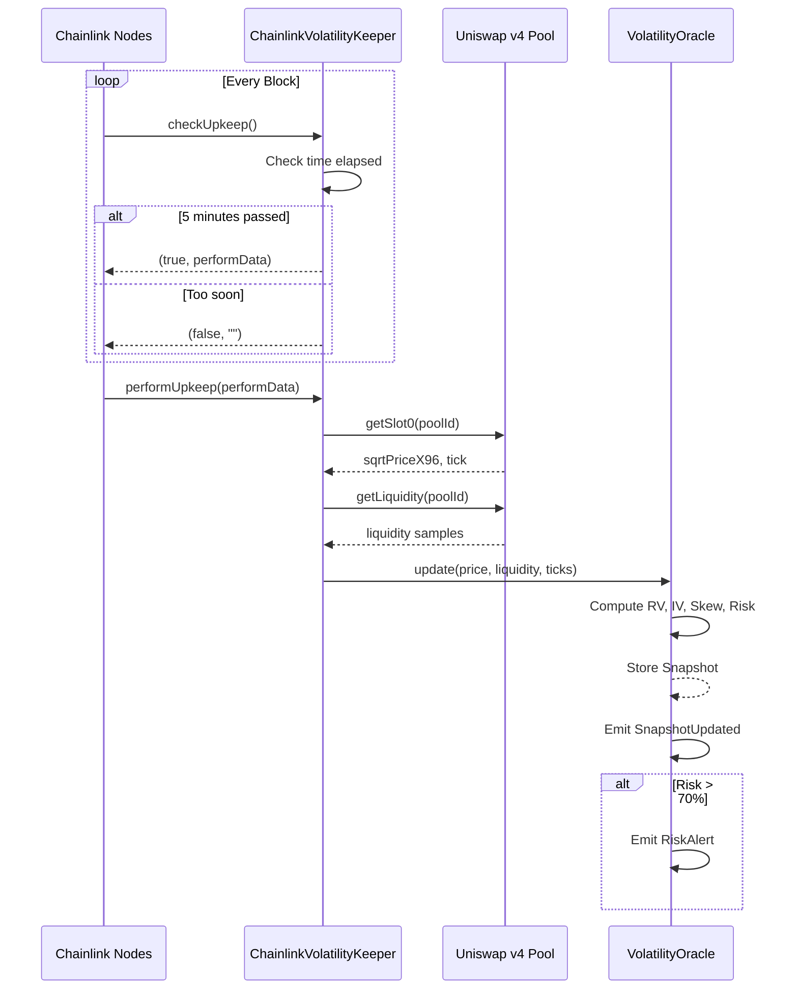
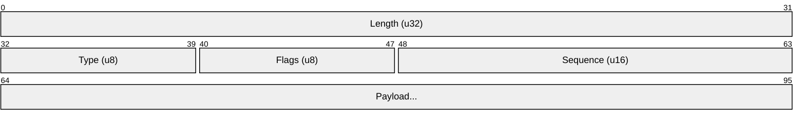

# Marigraph

Terminal-based volatility surface visualization and risk oracle, built with Bun and Ink.

> **mari-** (Latin: sea) + **-graph** (Greek: drawing) = "sea drawing" - visualizing the waves and surfaces of volatility

## Features

- **7-Column Risk Oracle** - 3D surface cube with risk inference panels
- **Binary IPC Protocol** - Efficient stdin/stdout communication between columns
- **Unix Socket Server** - External program integration via JSON-RPC
- **Volatility Surface Models** - SVI calibration, interpolation, arbitrage detection
- **Streaming Statistics** - Welford's algorithm for real-time metrics
- **YAML/JSON Templates** - Configurable layouts and event wiring

## Installation

```bash
bun install
```

## Usage

```bash
# Run TUI with demo data (hot reload)
bun run dev

# Run TUI
bun run start

# Run CLI
bun run cli --help

# Run with custom template
bun run cli --template my-config.yaml

# Generate example template
bun run cli --generate > template.yaml
```

## Risk Oracle Layout

```
┌─────────────┬─────────────────────────┬─────────────┐
│ Term        │                         │ Smile       │
│ Structure   │     3D SURFACE CUBE     │ Skew        │
├─────────────┤       (center)          ├─────────────┤
│ Slope       │                         │ Arbitrage   │
│ Analysis    │                         │ Detection   │
├─────────────┼─────────────────────────┼─────────────┤
│ Risk Score  │      Status / Log       │ Alerts      │
└─────────────┴─────────────────────────┴─────────────┘
```

## Architecture



### Event Flow



### Risk Oracle Data Flow



### On-Chain Oracle Architecture

```mermaid
flowchart TB
    subgraph OffChain["Off-Chain (Marigraph TUI)"]
        TUI[Terminal UI]
        Surface[Volatility Surface]
        Metrics[Risk Metrics Engine]
    end

    subgraph Uniswap["Uniswap v4"]
        PM[PoolManager]
        Hook[VolatilityHook]
    end

    subgraph Oracle["Volatility Oracle System"]
        VO[VolatilityOracle.sol]
        VM[VolatilityMath.sol]
        VK[VolatilityKeeper.sol]
    end

    subgraph Chainlink["Chainlink Automation"]
        CK[ChainlinkVolatilityKeeper]
        Registry[Keeper Registry]
        Nodes[Automation Nodes]
    end

    subgraph Consumers["On-Chain Consumers"]
        Vaults[Vault Strategies]
        Options[Options Protocols]
        Risk[Risk Managers]
    end

    TUI --> Surface
    Surface --> Metrics
    Metrics -->|Display| TUI

    PM -->|Pool State| Hook
    PM -->|sqrtPriceX96, liquidity| VK

    Hook -->|beforeSwap/afterSwap| VO
    VK -->|update()| VO
    VO --> VM

    CK -->|checkUpkeep| Nodes
    Nodes -->|performUpkeep| CK
    CK -->|update()| VO
    Registry -->|LINK| CK

    VO -->|getLatestSnapshot()| Consumers
    VO -->|getRiskScore()| Consumers
    VO -->|getVolSmile()| Consumers
```

### Oracle Data Payload



### Chainlink Automation Flow



### Binary Frame Protocol



### IPC Protocol

8-byte frame header:
- `length: u32` - payload length
- `type: u8` - message type
- `flags: u8` - compression, request flag
- `seq: u16` - sequence number

### Message Types

| Type | Value | Description |
|------|-------|-------------|
| INIT | 0x00 | Initialize column |
| READY | 0x01 | Column ready |
| SHUTDOWN | 0x02 | Graceful shutdown |
| SURFACE_FULL | 0x10 | Full surface data |
| SET_DATA | 0x20 | Set widget data |
| SELECTED | 0x30 | Item selected event |

## Modules

### Data Types (`src/data/`)
- `vec.ts` - Vec64/Vec32 TypedArray wrappers
- `surface.ts` - 3D surface with slope computation

### IPC (`src/ipc/`)
- `protocol.ts` - Message types and constants
- `frame.ts` - Binary frame encode/decode
- `serialize.ts` - Surface serialization

### Render (`src/render/`)
- `project.ts` - 3D to 2D projection
- `cube.ts` - Wireframe cube rendering
- `rasterize.ts` - ASCII/braille rasterization
- `gradient.ts` - Slope-based color mapping

### Statistics (`src/stats/`)
- `welford.ts` - Streaming mean/variance/skewness/kurtosis
- `dispersion.ts` - Full dispersion metrics
- `quantile.ts` - Percentile calculations

### Surface Models (`src/surface/`)
- `interpolate.ts` - Bilinear/bicubic interpolation
- `svi.ts` - SVI volatility model
- `arbitrage.ts` - Calendar/butterfly arbitrage detection

### Widgets (`src/column/widgets/`)
- `Surface.tsx` - 3D surface visualization
- `List.tsx` - Scrollable list
- `Table.tsx` - Data table
- `Chart.tsx` - Sparklines, bar charts
- `Log.tsx` - Append-only log

## Template Configuration

```yaml
name: my-dashboard
layout:
  rows: 2
  cols: 3

columns:
  - id: surface
    type: surface
    title: 3D View
    position:
      row: 0
      col: 1
      colSpan: 2

  - id: list
    type: list
    title: Items

wiring:
  - on:
      column: list
      event: SELECTED
    do:
      column: surface
      action: SET_DATA
```

## Testing

```bash
# Run all tests
bun test

# Run specific test file
bun test src/stats/stats.test.ts
```

## External Program Integration

Connect via Unix socket:
```bash
nc -U /tmp/sixcol-{id}/col1.sock
```

Send JSON-RPC:
```json
{"method": "setData", "params": {"data": [1, 2, 3]}}
{"method": "getData", "id": 1}
```

## License

MIT
